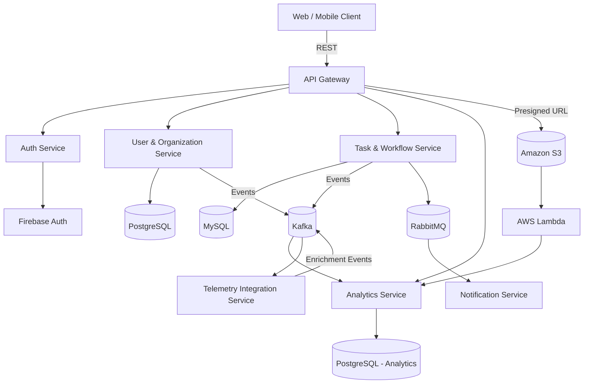

# FleetOps

FleetOps is a workforce and operations management platform designed for companies that manage distributed teams and physical operations such as logistics, field service, construction, maintenance, or equipment rental.

The platform focuses on task planning, execution tracking, reporting, and compliance. IoT integration is optional and serves only as an enrichment layer, not as the core of the system. This makes the project realistic: the system provides value even without IoT, while still being able to consume automated signals when available.

The project is intentionally designed as a small but production-style system that demonstrates architectural decision-making, data modeling depth, and pragmatic use of modern backend technologies.

---

## Key goals of the project

* Demonstrate clean microservice boundaries
* Show real-world usage of multiple databases
* Apply event-driven and streaming patterns
* Use cloud-native concepts (AWS Lambda, S3)
* Avoid artificial complexity while still covering advanced topics

---

## Core use cases

FleetOps helps organizations answer questions such as:

* What tasks are currently assigned to teams or users?
* Are tasks being completed on time and according to workflow?
* Where do delays or abnormal patterns occur?
* How can historical activity be audited for compliance or reporting?

The system combines:

* human-driven workflows (task creation, updates, reports)
* asynchronous processing (events, notifications, analytics)
* optional automated signals (IoT or third-party integrations)

---

## Users and roles

FleetOps is a multi-tenant system where all data is scoped to an organization.

### Admin users

Admins are responsible for configuration and oversight.

They can:

* create and manage organizations
* define teams and assign users
* create task templates and workflows
* configure alerting and integrations
* access aggregated analytics and exports

### Regular users

Regular users focus on execution.

They can:

* view assigned tasks
* update task statuses
* upload reports, photos, and documents
* receive alerts and notifications

### Why this separation exists

The distinction between Admin and User roles reflects real operational boundaries:

* configuration vs execution
* system-wide impact vs scoped actions
* different authorization and query patterns

This separation also enables clearer data access rules and more realistic authorization logic across services.

---

## Typical user flow

1. An admin registers an organization
2. Teams and users are created
3. Task templates and workflows are defined
4. Tasks are assigned to teams or individuals
5. Users execute tasks and update statuses
6. Users upload attachments as evidence
7. Optional external or IoT signals enrich task data
8. Admins review dashboards, analytics, and reports

---

## Architecture overview

FleetOps is implemented as a NestJS monorepo with several focused services and one Go-based service for high-throughput ingestion.

Services are split only where there is a clear boundary based on:

* data ownership
* scalability requirements
* responsibility isolation

The goal is clarity and maintainability, not microservices for their own sake.

---

## Services

### API Gateway (NestJS)

The API Gateway is the single entry point for all clients.

Responsibilities:

* authentication middleware
* request validation
* rate limiting
* routing to internal services
* REST API exposure

No business logic is implemented in the gateway.

---

### Auth Service (NestJS + Firebase)

The Auth Service handles authentication and authorization.

Responsibilities:

* Firebase Authentication integration
* token validation
* role and organization resolution
* internal gRPC interface for auth checks

Auth is kept separate because it is security-critical, stateless, and shared across all other services.

---

### User & Organization Service (PostgreSQL + Prisma)

This service manages business-level identity and structure.

Responsibilities:

* user profiles
* organizations
* teams
* role assignments
* access rules

PostgreSQL is used for strong consistency and relational integrity. Prisma provides type safety and controlled schema evolution.

This service demonstrates deeper database work, including:

* normalized core schemas
* denormalized read models (organization statistics)
* indexing for authorization-heavy queries
* read replicas for analytics-heavy endpoints

---

### Task & Workflow Service (MySQL + TypeORM)

This service owns operational data and task lifecycle logic.

Responsibilities:

* tasks and task templates
* workflow states
* execution history
* audit logs

MySQL is used to contrast with PostgreSQL and to demonstrate working with multiple relational databases, including different replication and locking characteristics.

---

### Analytics Service (NestJS + Kafka + PostgreSQL)

The Analytics Service builds aggregated and historical views of system activity.

Responsibilities:

* consume task lifecycle events
* process user activity events
* enrich data with optional external signals

This service uses:

* Kafka for event streaming
* time-based partitions
* denormalized aggregates
* materialized views

It is isolated to protect transactional services from heavy read and aggregation workloads.

---

### Telemetry Integration Service (Go)

This optional service integrates external data sources such as IoT or third-party systems.

Responsibilities:

* receive external signals
* validate and normalize incoming data
* publish enrichment events to Kafka

The service does not define core system behavior and exists purely as an enrichment layer.

Go is used for efficient IO handling and low-latency processing.

---

## Messaging and streaming

Kafka is used for:

* task lifecycle events
* analytics pipelines
* enrichment and reprocessing

RabbitMQ is used for:

* notifications
* retries and delayed jobs
* lightweight business events

This separation reflects common real-world usage patterns.

---

## AWS integration

### Amazon S3

S3 is used for object storage:

* task attachments (photos, documents)
* generated reports
* audit and compliance exports

Files are uploaded using pre-signed URLs generated by the API Gateway.

---

### AWS Lambda

AWS Lambda is used for isolated, event-driven workloads:

* generating PDF reports
* processing uploaded images
* scheduled compliance exports
* background data transformation

Lambdas are triggered by:

* S3 events
* scheduled rules
* internal asynchronous events

This approach avoids long-running infrastructure for workloads that are naturally ephemeral.

---

## Why not merge API Gateway, Auth, and User services?

In a smaller system, merging these services could be acceptable.

They are separated here to demonstrate clear responsibility boundaries:

* Auth is security-critical and stateless
* User data is business-critical and stateful
* Gateway is purely infrastructural

This separation improves clarity, scalability, and long-term maintainability without introducing unnecessary complexity.

---

## What this project demonstrates

* pragmatic microservice architecture
* multiple databases with clear ownership
* deep relational data modeling
* event-driven system design
* selective use of gRPC
* interoperability between Go and Node.js
* cloud-native patterns using AWS Lambda and S3

FleetOps is intentionally scoped to remain understandable while still reflecting real-world backend system design.

---

## Architecture diagram

---

## Database schemas

Below are simplified but realistic schemas that reflect service ownership and data boundaries.

---

### User & Organization Service (PostgreSQL + Prisma)

**organizations**

* id (uuid, pk)
* name (varchar)
* created_at (timestamp)
* status (active | suspended)

**users**

* id (uuid, pk)
* email (varchar, unique)
* display_name (varchar)
* created_at (timestamp)

**organization_members**

* id (uuid, pk)
* organization_id (fk -> organizations.id)
* user_id (fk -> users.id)
* role (ADMIN | USER)
* created_at (timestamp)

**teams**

* id (uuid, pk)
* organization_id (fk)
* name (varchar)

**team_members**

* team_id (fk -> teams.id)
* user_id (fk -> users.id)

**organization_stats (denormalized)**

* organization_id (pk)
* total_users (int)
* total_tasks (int)
* active_tasks (int)
* updated_at (timestamp)

Indexes:

* organization_members (organization_id, role)
* team_members (user_id)

---

### Task & Workflow Service (MySQL + TypeORM)

**tasks**

* id (char(36), pk)
* organization_id (char(36))
* assigned_team_id (char(36), nullable)
* assigned_user_id (char(36), nullable)
* status (CREATED | IN_PROGRESS | COMPLETED | CANCELLED)
* priority (LOW | MEDIUM | HIGH)
* due_date (datetime)
* created_at (datetime)

**task_templates**

* id (char(36), pk)
* organization_id (char(36))
* name (varchar)
* default_priority

**task_events (append-only)**

* id (bigint, pk)
* task_id (char(36))
* event_type (STATUS_CHANGED | COMMENT | ATTACHMENT_ADDED)
* payload (json)
* created_at (datetime)

Indexes:

* tasks (organization_id, status)
* task_events (task_id, created_at)

---

### Analytics Service (PostgreSQL)

**task_daily_stats (partitioned by date)**

* date (date)
* organization_id (uuid)
* completed_tasks (int)
* overdue_tasks (int)
* avg_completion_time (int)

**user_activity_stats**

* user_id (uuid)
* date (date)
* tasks_completed (int)
* tasks_updated (int)

Materialized views:

* organization_performance_view

---

### Object storage (Amazon S3)

**Buckets structure:**

* fleetops-attachments/{organizationId}/{taskId}/{fileId}
* fleetops-reports/{organizationId}/{reportId}.pdf

Metadata stored in Task Service (attachment references only).

---

### Event contracts (simplified)

TaskCreatedEvent

* taskId
* organizationId
* createdAt

TaskStatusChangedEvent

* taskId
* oldStatus
* newStatus
* changedAt

These events are published to Kafka and consumed by Analytics and Notification services.
